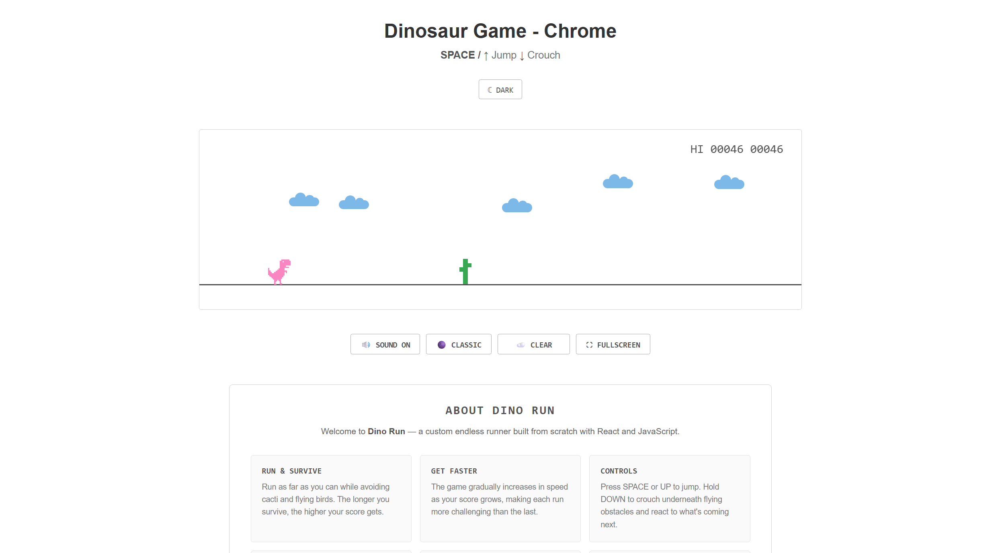
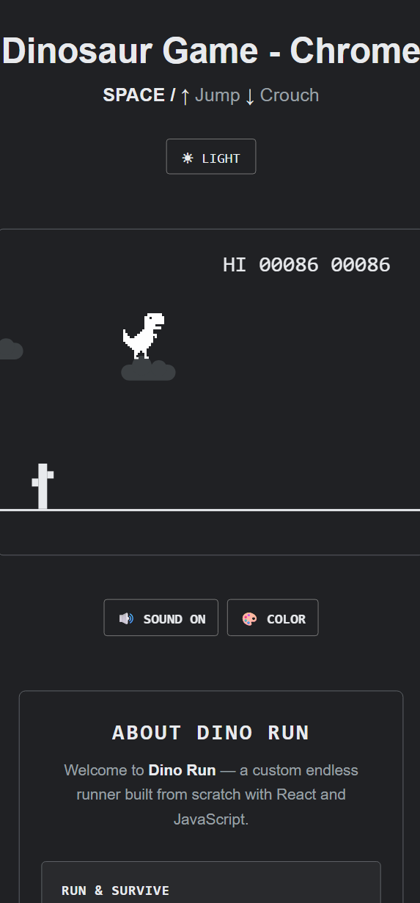

# Dino Run 🦖

A Chrome Dinosaur-inspired endless runner built from scratch with React, JavaScript, HTML, and CSS.

## Features ₊˚⊹ 𐂯

- Jump and crouch controls
- Touch controls for phones and tablets
- Cacti and flying bird obstacles
- Increasing game speed and difficulty
- Score and high score tracking
- Game over and restart system
- Jump and death sound effects
- Sound toggle
- Classic and Color modes
- Dark Mode
- Dynamic weather with clear, rain, and sunny conditions
- Animated clouds, rain, and sun
- Fullscreen mode
- English, Spanish, and Russian language support
- Custom dinosaur and game visuals
- Responsive interface for desktop, phones, and tablets

## Controls ⋆˚꩜｡

| Input | Action |
|---|---|
| `Space` / `↑` | Jump |
| `↓` | Crouch |
| `Enter` | Start / Restart |
| `Touch` | Tap to jump, swipe down to crouch |

## Built With ᯓ★

- React
- JavaScript
- HTML
- CSS
- Vite

## Screenshots ✧˖°

### Desktop Gameplay

### Mobile Gameplay

## Purpose .☘︎ ݁˖

This project was created to practice React, JavaScript, CSS, animations, game logic, collision detection, state management, and UI design while building a complete game from scratch.

## Author 𐙚

**Diana Khachaturova**

[GitHub](https://github.com/qopci) · [LinkedIn](https://www.linkedin.com/in/qopci/)